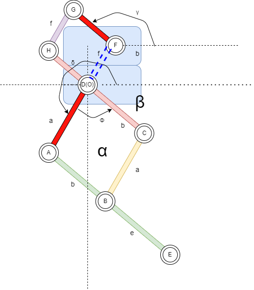
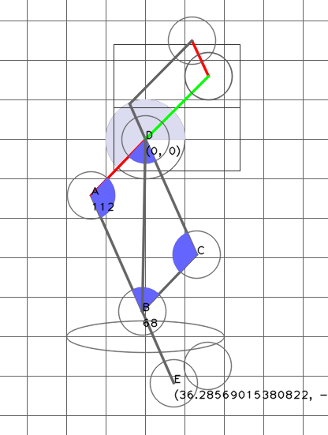

# SimpleLinkages
Simple Linkages for my robots
自作リンクロボットの簡単な4節リンクのプログラムを検討。
4節リンクの動きをシミュレートして可視化し、設計を検討します。
4節リンク/リンク/ピン の3つのクラスを作成して、順々に進化させていきます。

**設計概要**


**現在の表示**


---

# 設計

## 検討資料


[4節リンクのプログラムを検討](./doc/4節リンクのプログラム.md)を参照。

## 構成

以下のようなディレクトリ構成にします。

```
.
├── Linkages_lib
│   ├── __init__.py
│   ├── cpin.py
│   ├── clink.py
│   └── CFourBarLinkage.py
│
├── Linkages_lib_cli
│   └── call.py
└── setup.py

Python 3.8.10
OpenCV 4.5.4
moviepy 1.0.3

pip install moviepy 

pip install pyqtgraph
pip install PyQt5
sudo apt-get install python3-pyqt5

## 表示にpyQtGraphを使う
ライセンス的にpyQtGraphを使うとめんどくさいことになりそうですが、表示部分と計算部分を分けておけば問題ないでしょう。


## minicondaにsympyをインストールする
conda install sympy

```


