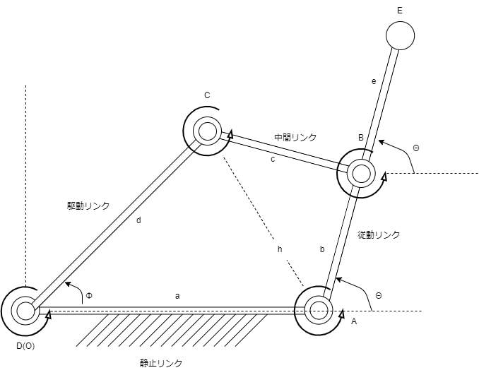

# SimpleLinkages
Simple Linkages for my robots
自作リンクロボットの簡単な4節リンクのプログラムを検討。
4節リンクの動きをシミュレートして可視化し、設計を検討します。
4節リンク/リンク/ピン の3つのクラスを作成して、順々に進化させていきます。

**設計概要**


**現在の実装のイメージ**
  

---

# 設計

## 検討資料


[4節リンクのプログラムを検討](./doc/4節リンクのプログラム.md)を参照。

## 構成

以下のようなディレクトリ構成にします。

```
.
├── Linkages_lib
│   ├── __init__.py
│   ├── cpin.py
│   ├── clink.py
│   └── CFourBarLinkage.py
│
├── Linkages_lib_cli
│   └── call.py
└── setup.py

Python 3.8.10
OpenCV 4.5.4

```

## 実装しながら作る


