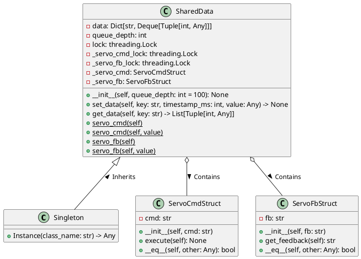

# SimpleLinkages
Simple Linkages for my robots
自作リンクロボットの簡単な4節リンクのプログラムを検討。
4節リンクの動きをシミュレートして可視化し、設計を検討します。
4節リンク/リンク/ピン の3つのクラスを作成して、順々に進化させていきます。

**設計概要**

順運動で計算する場合、この構造はモーターの角度から5節リンク4節リンクの計算を順番に解いていくことで計算することができる。
また、以下のように単純化して計算することも可能となる。


**単純化**

逆運動を計算するとき、下の図のように構造を単純化して計算する。
B1-Yの長さはb、Y-Eの長さはl1+a+e、リンクE-Iの相互関係は固定されているので計算可能、E-I-Jの角度はFのモーターの角度と同じ値となる。B1-Y-Eの角度はB1,B2の角度によって割り出すことができるので、逆算も可能。

**逆運動**

歩行を単純に考えるため、IとJのどちらか、もしくは両方が接地している条件で逆運動計算をして、B1,B2の角度を確定させてから、順運動で各頂点の位置とリンクの角度を決定する。
例えば、I-Jが接地している条件で、IのX座標の位置を指定する。
Eの位置をIから相対的に割り出すと、逆運動によってB1,B2の角度を計算することができる。


---

# 設計

## 検討資料


[4節リンクのプログラムを検討](./doc/4節リンクのプログラム.md)を参照。

## 構成

以下のようなディレクトリ構成にします。

```
.
├── Linkages_lib
│   ├── __init__.py
│   ├── cpin.py
│   ├── clink.py
│   └── CFourBarLinkage.py
│
├── Linkages_lib_cli
│   └── call.py
└── setup.py

Python 3.8.10
OpenCV 4.5.4
moviepy 1.0.3

pip install moviepy 

Circle3D

## minicondaにsympyをインストールする
conda install sympy

```

PyDyで計算できそう
https://pydy.readthedocs.io/en/stable/examples/rocket-car.html


----

2023/7/2
必要な作業

+ PCからの切断後、再接続待ちになるようにArduino側のソフトを改良する...完了
+ Constructを使って、通信データのパースが楽にできるように実装する...完了
+ サーボからの角度データ、電圧を受信して、PC側に表示する
  + Arduinoのwifiテストサンプルをサーボコントロール側にマージする...完了
+ PC側の機構データに反映して、脚の角度が可視化できるようにする
  + ワイヤーフレーム表示に反映する
    + まず、wifi-test.pyの実装をmain.pyにマージして、通信データを受信...完了
    + 他のライブラリとの関係をクラス図にして、受信したデータを
        self.robot.set_angles(theta1, theta2)
        self.robot.update_position()
      の形で値をセットして、アップデートして角度を決める。
      サーボのポイントから角度を割り出す関数を作成して、その角度をrobotにセットする。
    


+ 原点調整ができるようにする。調整モードで立ち上げた後、微調整してファイルに保存し、次回起動時は微調整値を読み込んで起動する


---

# SharedData クラス

## 概要
`SharedData`クラスは、複数のスレッド間で共有可能なデータをスレッドセーフに管理するためのクラスです。このクラスでは、特定のデータ(`servocmd` と `ServoFb`) がプロパティとして実装されており、それぞれのアクセスがスレッドセーフとなるようにロックが適用されています。これにより、同時にアクセスしようとする複数のスレッドからのデータ競合や不整合を防いでいます。また、Singletonパターンが適用されており、全体で一つのインスタンスしか生成されません。

## クラス図


## 属性

- `data`: 各キーの時系列データを保持する辞書。
- `queue_depth`: 保持する時系列データの深さ(デフォルト値:100)。
- `lock`: スレッドセーフな操作のための総合的なロックオブジェクト。
- `_servo_cmd_lock`: `ServoCmd` オブジェクトへのアクセスをスレッドセーフにするためのロックオブジェクト。
- `_servo_fb_lock`: `ServoFb` オブジェクトへのアクセスをスレッドセーフにするためのロックオブジェクト。
- `_servo_cmd`: `ServoCmdStruct` オブジェクト。
- `_servo_fb`: `ServoFbStruct` オブジェクト。

## メソッド

### `__init__(self, queue_depth: int = 100): None`
コンストラクタです。queue_depth は時系列データの最大保存数を指定します。

### `set_data(self, key: str, timestamp_ms: int, value: Any) -> None`
指定されたキーに対応する時系列データを追加します。timestamp_msはUnixエポックからのミリ秒単位のタイムスタンプです。

### `get_data(self, key: str) -> List[Tuple[int, Any]]`
指定されたキーに対応する全時系列データを取得します。

### `servo_cmd(self)`
`ServoCmdStruct` オブジェクトを取得します。スレッドセーフにアクセスされます。

### `servo_cmd(self, value)`
`ServoCmdStruct` オブジェクトを設定します。スレッドセーフにアクセスされます。

### `servo_fb(self)`
`ServoFbStruct` オブジェクトを取得します。スレッドセーフにアクセスされます。

### `servo_fb(self, value)`
`ServoFbStruct` オブジェクトを設定します。スレッドセーフにアクセスされます。

## メモ
- `Singleton`メタクラスから継承しています。

---

