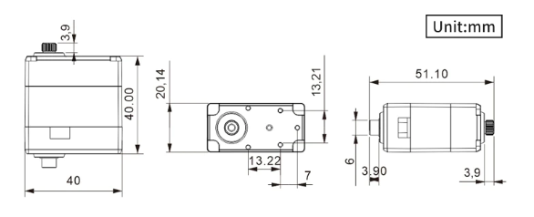

# 4節リンクの歩行を検討する

2足歩行の検討に使用することができて、実機に拡張可能なプログラムを作成する。

数式は以下のページを参考にさせていただいて記述しました。
[数学の景色](https://mathlandscape.com/latex-eq/)

逆運動学の計算は以下のページをほぼそのまま使わせていただいています。
[2リンクモデルの逆運動学を求める！順運動学の式から算出する方法](https://tajimarobotics.com/kinematics-two-link-model-2/)

以下のページを参考にさせていただいています。
[四足歩行研究プラットフォームの設計、開発、および実験的実現: Stoch](https://arxiv.org/abs/1901.00697)

計算式の中身の理解の参考にさせていただいています。
[機構学 Part4：リンク機構とその応用](http://www-hh.mech.eng.osaka-u.ac.jp/~mk/kougi/kikou_Part4.pdf)

材料・部品のメモ
[フラットスチールベアリング](https://search.sugatsune.co.jp/product/g/gAS-22-A15-55_2/)

使用予定のサーボ
[HiWonder LX-224 シリアルバスサーボ 20kg/240°/フィードバック付き](https://www.switch-science.com/products/7136)

## 実用を考えて、平行リンクとして計算する
計算を簡単にして逆運動学が計算しやすいように平行リンクで計算する。

ここを参考にして図を修正し、式を整える。

重量のあるモーターを胴体に近いところに格納して、モーメントに振り回されないようにするためのリンク構造なので、リンク長をa=c,b=dとして計算を単純化することとしました。

#### A/B/C/D/Eの座標を計算する
$$
\begin{align}
A &= (a, 0) \\
B &= (a + d \cos\phi , b \sin\phi) \\
C &= (b \cos\phi , b \sin\phi) \\
D &= (0, 0) \\
E &= (a+(b+e) \cos\phi , (b+e) \sin\phi)
\end{align}
$$

#### A/B/C/D/Eの座標を計算する、回転も含めた計算式に変更する

平行リンクの脚はこんなイメージになるはず。

$$
\begin{align}
A_x &= a \cos(\delta) \\
A_y &= a \sin(\delta) \\
B_x &= a \cos(\delta)+b \cos(\delta + \phi) \\
B_y &= a \sin(\delta)+b \sin(\delta + \phi) \\
C_x &= b \cos\phi \cos\delta - b \sin\phi \sin\delta \\
C_y &= b \cos\phi \sin\delta + b \sin\phi \cos\delta \\
D_x &= 0 \\
D_y &= 0 \\
E_x &= a \cos(\delta)+(b+e) \cos(\delta + \phi) \\
E_y &= a \sin(\delta)+(b+e) \sin(\delta + \phi) \\
\end{align}
$$

の式で表されます。
平行リンクは2リンクモデルと同様（だと思う）ので、点Eの座標からの逆運動を計算する式を使って計算する。
計算式は下のリンクを参考にさせていただきます。
[2リンクモデルの逆運動学を求める！順運動学の式から算出する方法](https://tajimarobotics.com/kinematics-two-link-model-2/)

$$
\begin{align}
\delta &= \pm \cos^{-1} \bigl( \frac{x^2+y^2+a^2-(b+e)^2}{2a \sqrt{x^2+y^2}} \bigr) + \tan^{-1}(\frac{y}{x}) \\
\phi &= \tan^{-1}(\frac{y-a\sin\delta}{x-a\cos\delta})-\delta
\end{align}
$$

----
## ピンDの周辺にモーターを集中させないようにする

モーターの配置を考えてみる。
見た目と計算は楽そうだけど、重心が前に出すぎ。

上に向かってモータを積んでみる。多分、これが皆さんが使用しているモーター配置に近い。
αの平行リンクと、βの平行リンクの組み合わせで、E点の軌跡を作る。
（図中、赤のリンクが駆動軸）
D-Fの長さfは、モーターの大きさで決まる。
F(x,y)の座標は初期設定で固定される

角度$\gamma$の角度は逆運動で求めた$\phi$と$\delta$から決定する。
$$
\begin{align}
\phi &= \gamma - \delta \\
G_x &= F_x+b\cos(\gamma) \\
G_y &= F_y+b\sin(\gamma) 
\end{align}
$$

