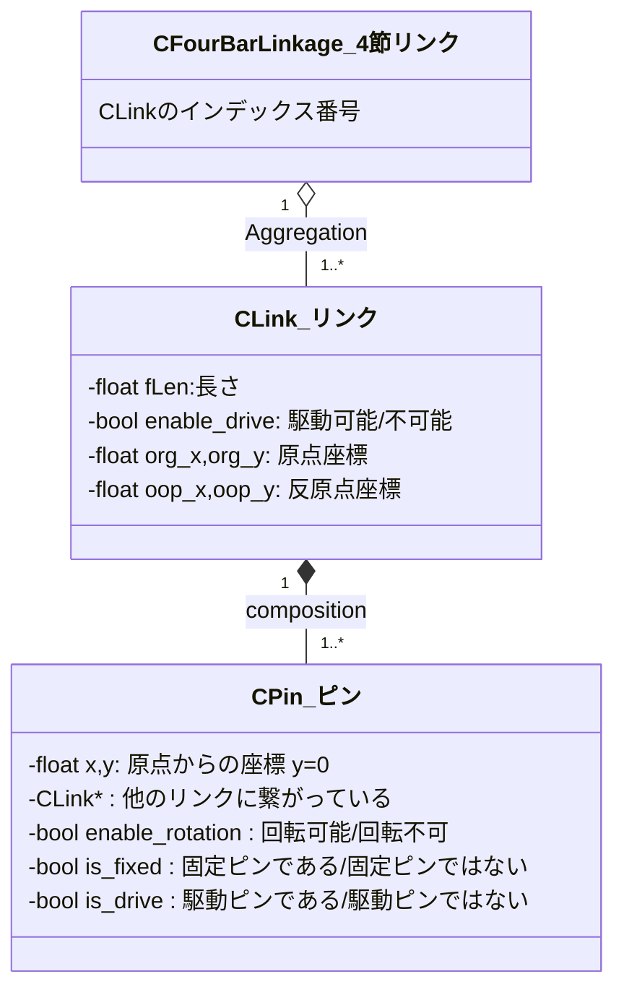
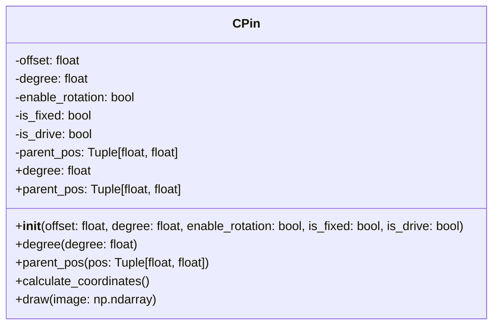

# 4節リンクの歩行を検討する

2足歩行の検討に使用することができて、実機に拡張可能なプログラムを作成する。

## 4節リンクモデル

`リンク`は`長さ`を持つ直線で、両端に`原点`と`反原点`がある。
リンクは原点と反原点の間に`複数のピン`を持ち、`他のリンクと繋がっている`。

接点を軸にしてリンクは`回転可能`で、`回転角度に制限`を持たせることができる。
`固定ピン`は`世界座標`上に固定されていて、座標は変更されない。
`回転不可`に設定されたピンにつながっているリンクは回転できない。

`駆動ピン`と固定ピンに設定されたピンを持つリンクは、駆動ピンを中心に自発的に自身の角度を変更して、他のリンクの座標や角度に影響を与える。

`駆動ピン`で`固定ピンではない`ピンは、駆動ピンを中心に自発的に角度と自身のピンの位置を変更して、他のリンクの座標や角度に影響を与える。
（処理が煩雑になるので、直近はこの組合せの駆動リンクを作成しない）

`固定ピン`を2つ以上持つリンクは角度や位置を変更できない固定軸となる。


>直近は駆動軸は世界座標に固定されて、他のリンクの動きに影響を与えるだけとする。
固定されてないリンクには駆動軸を設定しない。
実装の難易度を低くするため。

## 4節リンクモデル計算式

4節リンクの角度の計算式。
Dの角度Φは指令する。
Dを原点(0,0)として、Aは(a,0)。
余弦定理で角度を計算する。

https://math-jp.net/2018/08/26/yogenteiri-kakudo/


```math
D = (0, 0) \\
A = (a, 0) \\
C = (d \cosΦ , d \sinΦ)
　\\
　\\
\cosΦ_1 = \frac{a^2 + g^2 - b^2}{2ag} \\\\
　\\

B = (g \cosΦ_1 , g \sinΦ_1)

```


## 4節リンクのクラス図

検討レベルのクラス図。
こんな感じ？
clink,cpinの初期化をjsonでするところまではOK。親座標を継承して伝搬させる仕組みの構築。



https://zenn.dev/tak_uchida/articles/da583cf960e854

---

### 詳細なクラス図


```
    - offset: 親オブジェクトの原点からのピンのオフセット
    - degree: 親オブジェクトの原点を中心にしたピンの回転角度
    - enable_rotation: ピンが回転できるかどうかを示すフラグ
    - is_fixed: ピンが固定されているかどうかを示すフラグ
    - is_drive: ピンがドライブピンかどうかを示すフラグ
    - parent_pos: 親オブジェクトの位置
    + __init__: コンストラクタ
    + degree: ピンの角度を取得するプロパティ
    + degree(degree: float): ピンの角度を設定するメソッド
    + parent_pos: 親オブジェクトの位置を取得するプロパティ
    + parent_pos(pos: Tuple[float, float]): 親オブジェクトの位置を設定するメソッド
    + calculate_coordinates: ピンの状態に基づいて値を計算するメソッド
    + draw(image: np.ndarray): 画像にピンを描画
```


