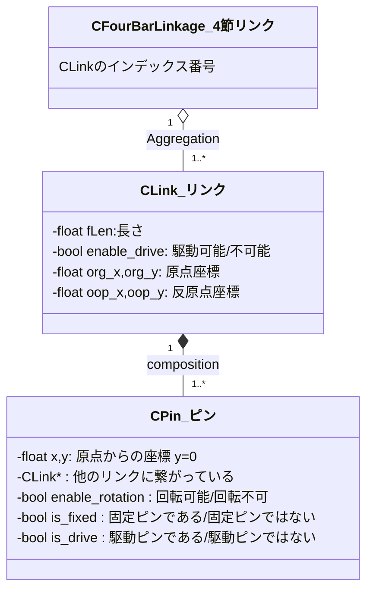
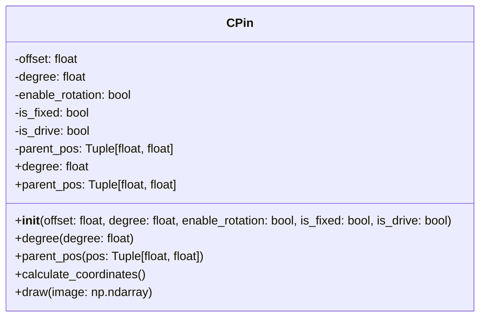

# 4節リンクの歩行を検討する

2足歩行の検討に使用することができて、実機に拡張可能なプログラムを作成する。

数式は以下のページを参考にさせていただいて記述しました。
[数学の景色](https://mathlandscape.com/latex-eq/)

## 4節リンクモデル

`リンク`は`長さ`を持つ直線で、両端に`原点`と`反原点`がある。
リンクは原点と反原点の間に`複数のピン`を持ち、`他のリンクと繋がっている`。

接点を軸にしてリンクは`回転可能`で、`回転角度に制限`を持たせることができる。
`固定ピン`は`世界座標`上に固定されていて、座標は変更されない。
`回転不可`に設定されたピンにつながっているリンクは回転できない。

`駆動ピン`と固定ピンに設定されたピンを持つリンクは、駆動ピンを中心に自発的に自身の角度を変更して、他のリンクの座標や角度に影響を与える。

`駆動ピン`で`固定ピンではない`ピンは、駆動ピンを中心に自発的に角度と自身のピンの位置を変更して、他のリンクの座標や角度に影響を与える。
（処理が煩雑になるので、直近はこの組合せの駆動リンクを作成しない）

`固定ピン`を2つ以上持つリンクは角度や位置を変更できない固定軸となる。


>直近は駆動軸は世界座標に固定されて、他のリンクの動きに影響を与えるだけとする。
固定されてないリンクには駆動軸を設定しない。
実装の難易度を低くするため。

## 4節リンクモデル計算式

4節リンクの角度の計算式。
Dの角度Φは指令する。
Dを原点(0,0)として、Aは(a,0)。
余弦定理で角度を計算する。

https://math-jp.net/2018/08/26/yogenteiri-kakudo/


### 計算しやすいA/C/Dの座標を計算する
$$
\begin{align}
D = (0, 0) \\
A = (a, 0) \\
C = (d \cosΦ , d \sinΦ) \\
\end{align}
$$

### 対角線hを計算し、ABCの角度を計算する
$$
\begin{align}
h = \sqrt{(C_x - a)^2 + C_y ^2} \\
\cos B = \frac{b^2 + c^2 - h^2}{2bc} \\\\ 
\cos \angle DCA = \frac{d^2 + h^2 - a^2} {2dh} \\
\cos \angle ACB = \frac{c^2 + h^2 - b^2} {2ch} \\
\angle C = \angle DCA + \angle ACB \\
\angle A = \angle 360 - \angle C + \angle B  + \angle Φ \\
\end{align}
$$

### Bの座標を計算する
$$
\begin{align}
\angle Θ = \angle 180 - \angle A \\
B_x = a + b * \cos Θ \\
B_y = b * \sin Θ \\
\end{align}
$$

### おまけ。図上の角度も計算しておく
$$
\begin{align}
\angle Φ_1 = \arctan \frac{B_y}{B_x} \\
\angle Φ_2 = \angle Φ - \angle Φ_1 \\
\end{align}
$$

### リンクを伸ばす
従動リンクを伸ばして、その先端の動きを観察できるようにする。
長さeのリンクを従動リンクにつなぐ。


頂点Aを基準にして頂点Eを計算する。

```math
B = (B_x,B_y) \\
E = (B_x + \cos Θ * e , B_y + \sin Θ * e) 
```

## 実用を考えて、平行リンクとして計算する
計算を簡単にして逆運動学が計算しやすいように改良する。
アークコサインを使って角度を求めるのではなく、加法定理などを使って計算を整理する。

すごくわかりやすい機構学のページ。
http://www-hh.mech.eng.osaka-u.ac.jp/~mk/kougi/kikou_Part4.pdf

ここを参考にして図を修正し、式を整える。
逆運動学をするためには、行列式にしておきたい。


重量のあるモーターを胴体に近いところに格納して、モーメントに振り回されないようにするためのリンク構造なので、リンク長をa=c,b=dとして計算を単純化することとした。
そうすると、今まで苦労してきた計算のほとんどが不要になるが・・・

#### A/B/C/D/Eの座標を計算する
$$
\begin{align}
A &= (a, 0) \\
B &= (a + d \cos\phi , b \sin\phi) \\
C &= (b \cos\phi , b \sin\phi) \\
D &= (0, 0) \\
E &= (a+(b+e) \cos\phi , (b+e) \sin\phi)
\end{align}
$$

#### A/B/C/D/Eの座標を計算する、回転も含めた計算式に変更する

$$
\begin{align}
A_x &= a \cos(\delta) \\
A_y &= a \sin(\delta) \\
B_x &= a \cos(\delta)+b \cos(\delta + \phi) \\
B_y &= a \sin(\delta)+b \sin(\delta + \phi) \\
C_x &= b \cos\phi \cos\delta - b \sin\phi \sin\delta \\
C_y &= b \cos\phi \sin\delta + b \sin\phi \cos\delta \\
D_x &= 0 \\
D_y &= 0 \\
E_x &= a \cos(\delta)+(b+e) \cos(\delta + \phi) \\
E_y &= a \sin(\delta)+(b+e) \sin(\delta + \phi) \\
\end{align}
$$

の式で表されます。
平行リンクは2リンクモデルと同様（だと思う）ので、点Eの座標からの逆運動を計算する式を使って計算する。
計算式は下のリンクを参考にさせていただきます。
[2リンクモデルの逆運動学を求める！順運動学の式から産出する方法](https://tajimarobotics.com/kinematics-two-link-model-2/)

$$
\begin{align}
\delta &= \pm \cos^{-1} \bigl( \frac{x^2+y^2+a^2-(b+e)^2}{2a \sqrt{x^2+y^2}} \bigr) + \tan^{-1}(\frac{y}{x}) \\
\phi &= \tan^{-1}(\frac{y-a\sin\delta}{x-a\cos\delta})-\delta
\end{align}
$$


----
と、かなり簡単になった。
平行リンクを平行移動し、それを回転させたい。
$$
\begin{pmatrix} 
\acute{x} \\ 
\acute{y} \\
\end{pmatrix} =
\begin{pmatrix} 
x \\ 
y \\
\end{pmatrix} +
\begin{pmatrix} 
t_x \\ 
t_y \\
\end{pmatrix}
$$

ここに、D(0,0)を中心にして回転する要素を加える。

$$
R = 
\begin{pmatrix} 
\ cos \delta & -\ sin \delta \\ 
\ sin \delta & \ cos \delta \\
\end{pmatrix}
$$

Eの計算を順運動学で計算すると、以下のようになる。

$$
\begin{align}
E&=
\begin{pmatrix} 
x_e \\ 
y_e \\
\end{pmatrix} = 
\begin{pmatrix} 
(b+e) \ cos \phi \\ 
(b+e) \ sin \phi \\
\end{pmatrix}
\end{align}
$$

$$
\begin{align}
\acute{E} &= 
\begin{pmatrix} 
x_{\acute{e}} \\ 
y_{\acute{e}} \\
\end{pmatrix} \\&= 
\begin{pmatrix} 
\ cos \delta & -\ sin \delta \\ 
\ sin \delta & \ cos \delta \\
\end{pmatrix}
\Biggl(
\begin{pmatrix} 
(b+e) \ cos \phi \\ 
(b+e) \ sin \phi \\
\end{pmatrix} +
\begin{pmatrix} 
t_x \\ 
t_y \\
\end{pmatrix}
\Biggl)
\\&=
\begin{pmatrix} 
\ cos \delta & -\ sin \delta \\ 
\ sin \delta & \ cos \delta \\
\end{pmatrix}
\begin{pmatrix} 
(b+e) \ cos \phi + t_x \\ 
(b+e) \ sin \phi + t_y \\
\end{pmatrix}
\\ &=
\begin{pmatrix} 
\cos \delta  \times ((b+e) \cos \phi + t_x) - \sin \delta  \times ((b+e) \sin \phi + t_y) \\ 
\sin \delta  \times ((b+e) \cos \phi + t_x) + \cos \delta  \times ((b+e) \sin \phi + t_y) \\ 
\end{pmatrix}
\end{align}
$$

平行リンクの長さと位置の計算を工夫してみる。
先端の目標位置を決め、軌跡を限定する。

回転角度$\delta$を与えて、平行リンクを回転させてから、以下の順番で脚の位置を決定する。


計算式。
$$
\begin{align}
\begin{pmatrix} 
x_{\acute{e}} \\ 
y_{\acute{e}} \\
\end{pmatrix} &= 
\begin{pmatrix} 
a+(b+e) \times \cos (\phi + \delta) \\ 
(b+e) \times \sin (\phi + \delta) \\ 
\end{pmatrix} \\
\end{align}
$$

$$
\begin{align}
\arccos ( \frac{x_{\acute{e}}-a}{b+e} )= \phi + \delta \\ 
\arcsin ( \frac{y_{\acute{e}}}{b+e} )= \phi + \delta \\  
\end{align}
$$

$$
\begin{align}
\phi = \arccos ( \frac{x_{\acute{e}}-a}{b+e} ) - \delta\\ 
\phi = \arcsin ( \frac{y_{\acute{e}}}{b+e} ) - \delta\\  
\end{align}
$$

計算式　$\phi = \arccos ( \frac{y_{\acute{e}}}{b+e} ) - \delta$　から　$y_{\acute{e}}=F_y$　と$\delta = \delta_1$(設定値)　とする。

$\phi$と$\delta$が確定するので、すべての点の位置が確定する。

---
---
$\cos \delta$と$\sin \delta$は回転行列の要素です。$\phi$は回転角度です。$(b+e) \cos \phi$と$(b+e) \sin \phi$は回転前の座標です。$t_x$と$t_y$は平行移動量です。

それでは、式を整理していきます。

$\cos \delta$と$\sin \delta$は回転行列の要素です。$\phi$は回転角度です。$(b+e) \cos \phi$と$(b+e) \sin \phi$は回転前の座標です。$t_x$と$t_y$は平行移動量です。

それでは、この式を整理してみます。

$x = \cos \delta \times ((b+e) \cos \phi + t_x) - \sin \delta \times ((b+e) \sin \phi + t_y)$

$x = (\cos \delta \times (b+e) \cos \phi + \cos \delta \times t_x) - (\sin \delta \times (b+e) \sin \phi + \sin \delta \times t_y)$

$x = \cos \delta \times (b+e) \cos \phi + \cos \delta \times t_x - \sin \delta \times (b+e) \sin \phi - \sin \delta \times t_y$

$x = (\cos \delta \times (b+e) \cos \phi - \sin \delta \times (b+e) \sin \phi) + (\cos \delta \times t_x - \sin \delta \times t_y)$

$x = (b+e)(\cos \delta \cos \phi - \sin \delta \sin \phi) + (\cos \delta \times t_x - \sin \delta \times t_y)$

$x = (b+e)\cos(\delta - \phi) + (\cos \delta \times t_x - \sin \delta \times t_y)$

これで、式を整理することができました。

$y = \sin \delta \times ((b+e) \cos \phi + t_x) + \cos \delta \times ((b+e) \sin \phi + t_y)$

$y = (\sin \delta \times (b+e) \cos \phi + \sin \delta \times t_x) + (\cos \delta \times (b+e) \sin \phi + \cos \delta \times t_y)$

$y = \sin \delta \times (b+e) \cos \phi + \sin \delta \times t_x + \cos \delta \times (b+e) \sin \phi + \cos \delta \times t_y$

$y = (\sin \delta \times (b+e) \cos \phi + \cos \delta \times (b+e) \sin \phi) + (\sin \delta \times t_x + \cos \delta \times t_y)$

$y = (b+e)(\sin \delta \cos \phi + \cos \delta \sin \phi) + (\sin \delta \times t_x + \cos \delta \times t_y)$

$y = (b+e)\sin(\delta + \phi) + (\sin \delta \times t_x + \cos \delta \times t_y)$

これで、式を整理することができました。

現在の$x$と$y$の式を$\delta$と$\phi$を求める式に変更するには、逆回転を行う必要があります。

逆回転を行うと、回転行列が以下のようになります。

$x' = x \cos \phi + y \sin \phi$

$y' = -x \sin \phi + y \cos \phi$

これらを用いて、$x$と$y$を求める式を求めます。

---

平行リンクの平行移動を加えると計算がややこしくなるので、平行移動を削除してみる。

$$
\begin{align}
\acute{E} &= 
\begin{pmatrix} 
x_{\acute{e}} \\ 
y_{\acute{e}} \\
\end{pmatrix} \\&= 
\begin{pmatrix} 
\ cos \delta & -\ sin \delta \\ 
\ sin \delta & \ cos \delta \\
\end{pmatrix}
\begin{pmatrix} 
(b+e) \ cos \phi \\ 
(b+e) \ sin \phi \\
\end{pmatrix} 
\\ &=
\begin{pmatrix} 
(b+e) \cos \phi \cos \delta - (b+e) \sin \phi \sin \delta \\ 
(b+e) \cos \phi \sin \delta + (b+e) \sin \phi \cos \delta \\ 
\end{pmatrix}
\\ &=
\begin{pmatrix} 
(b+e) ( \cos \phi \cos \delta - \sin \phi \sin \delta) \\ 
(b+e) ( \cos \phi \sin \delta + \sin \phi \cos \delta) \\ 
\end{pmatrix}
\end{align}
$$

加法定理を使ってもう少し整理

$$
\begin{align}
\begin{pmatrix} 
x_{\acute{e}} \\ 
y_{\acute{e}} \\
\end{pmatrix} &= 
\begin{pmatrix} 
(b+e) \times \cos (\phi + \delta) \\ 
(b+e) \times \sin (\phi + \delta) \\ 
\end{pmatrix} \\
\begin{pmatrix} 
\frac{x_{\acute{e}}}{b+e} \\ 
\frac{y_{\acute{e}}}{b+e} \\
\end{pmatrix} &= 
\begin{pmatrix} 
\cos (\phi + \delta) \\ 
\sin (\phi + \delta) \\ 
\end{pmatrix}
\end{align}
$$

$$
\begin{align}
\frac{x_{\acute{e}}}{b+e} = \cos (\phi + \delta) \\ 
\frac{y_{\acute{e}}}{b+e} = \sin (\phi + \delta) \\  
\end{align}
$$

$$
\begin{align}
\arccos ( \frac{x_{\acute{e}}}{b+e} )= \phi + \delta \\ 
\arcsin ( \frac{y_{\acute{e}}}{b+e} )= \phi + \delta \\  
\end{align}
$$

### 逆運動学


## 4節リンクのクラス図

検討レベルのクラス図。
こんな感じ？
clink,cpinの初期化をjsonでするところまではOK。親座標を継承して伝搬させる仕組みの構築。



https://zenn.dev/tak_uchida/articles/da583cf960e854

---

### 詳細なクラス図


```
    - offset: 親オブジェクトの原点からのピンのオフセット
    - degree: 親オブジェクトの原点を中心にしたピンの回転角度
    - enable_rotation: ピンが回転できるかどうかを示すフラグ
    - is_fixed: ピンが固定されているかどうかを示すフラグ
    - is_drive: ピンがドライブピンかどうかを示すフラグ
    - parent_pos: 親オブジェクトの位置
    + __init__: コンストラクタ
    + degree: ピンの角度を取得するプロパティ
    + degree(degree: float): ピンの角度を設定するメソッド
    + parent_pos: 親オブジェクトの位置を取得するプロパティ
    + parent_pos(pos: Tuple[float, float]): 親オブジェクトの位置を設定するメソッド
    + calculate_coordinates: ピンの状態に基づいて値を計算するメソッド
    + draw(image: np.ndarray): 画像にピンを描画
```


