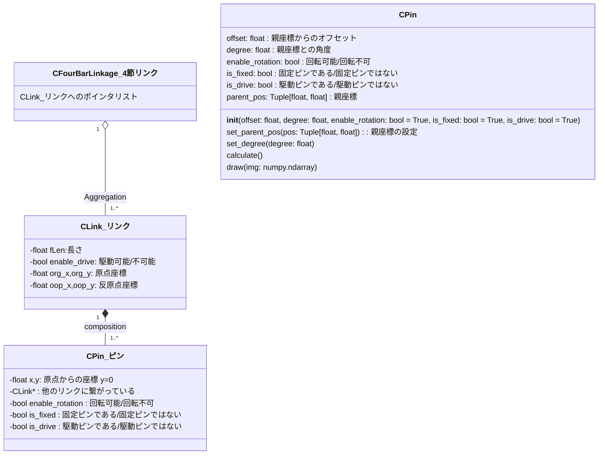

# 4節リンクの歩行を検討する

2足歩行の検討に使用することができて、実機に拡張可能なプログラムを作成する。

## 4節リンクモデル

`リンク`は`長さ`を持つ直線で、両端に`原点`と`反原点`がある。
リンクは原点と反原点の間に`複数のピン`を持ち、`他のリンクと繋がっている`。

接点を軸にしてリンクは`回転可能`で、`回転角度に制限`を持たせることができる。
`固定ピン`は`世界座標`上に固定されていて、座標は変更されない。
`回転不可`に設定されたピンにつながっているリンクは回転できない。

`駆動ピン`と固定ピンに設定されたピンを持つリンクは、駆動ピンを中心に自発的に自身の角度を変更して、他のリンクの座標や角度に影響を与える。

`駆動ピン`で`固定ピンではない`ピンは、駆動ピンを中心に自発的に角度と自身のピンの位置を変更して、他のリンクの座標や角度に影響を与える。
（処理が煩雑になるので、直近はこの組合せの駆動リンクを作成しない）

`固定ピン`を2つ以上持つリンクは角度や位置を変更できない固定軸となる。

>直近は駆動軸は世界座標に固定されて、他のリンクの動きに影響を与えるだけとする。
固定されてないリンクには駆動軸を設定しない。
実装の難易度を低くするため。

## 4節リンクのクラス図

https://zenn.dev/tak_uchida/articles/da583cf960e854