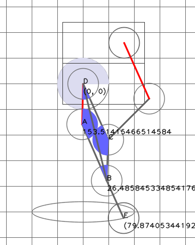
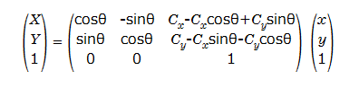

# 4節リンクの歩行を検討する

2足歩行の検討に使用することができて、実機に拡張可能なプログラムを作成する。

数式は以下のページを参考にさせていただいて記述しました。
[数学の景色](https://mathlandscape.com/latex-eq/)

逆運動学の計算は以下のページをほぼそのまま使わせていただいています。
[2リンクモデルの逆運動学を求める！順運動学の式から算出する方法](https://tajimarobotics.com/kinematics-two-link-model-2/)

以下のページを参考にさせていただいています。
[四足歩行研究プラットフォームの設計、開発、および実験的実現: Stoch](https://arxiv.org/abs/1901.00697)

計算式の中身の理解の参考にさせていただいています。
[機構学 Part4：リンク機構とその応用](http://www-hh.mech.eng.osaka-u.ac.jp/~mk/kougi/kikou_Part4.pdf)

材料・部品のメモ
[フラットスチールベアリング](https://search.sugatsune.co.jp/product/g/gAS-22-A15-55_2/)

使用予定のサーボ
[HiWonder LX-224 シリアルバスサーボ 20kg/240°/フィードバック付き](https://www.switch-science.com/products/7136)

## 実用を考えて、平行リンクとして計算する
計算を簡単にして逆運動学が計算しやすいように平行リンクで計算する。

ここを参考にして図を修正し、式を整える。

重量のあるモーターを胴体に近いところに格納して、モーメントに振り回されないようにするためのリンク構造なので、リンク長をa=c,b=dとして計算を単純化することとしました。

#### A/B/C/D/Eの座標を計算する
$$
\begin{align}
A &= (a, 0) \\
B &= (a + d \cos\phi , b \sin\phi) \\
C &= (b \cos\phi , b \sin\phi) \\
D &= (0, 0) \\
E &= (a+(b+e) \cos\phi , (b+e) \sin\phi)
\end{align}
$$

#### A/B/C/D/Eの座標を計算する、回転も含めた計算式に変更する

平行リンクの脚はこんなイメージになるはず。

$$
\begin{align}
A_x &= a \cos(\delta) \\
A_y &= a \sin(\delta) \\
B_x &= a \cos(\delta)+b \cos(\delta + \phi) \\
B_y &= a \sin(\delta)+b \sin(\delta + \phi) \\
C_x &= b \cos\phi \cos\delta - b \sin\phi \sin\delta \\
C_y &= b \cos\phi \sin\delta + b \sin\phi \cos\delta \\
D_x &= 0 \\
D_y &= 0 \\
E_x &= a \cos(\delta)+(b+e) \cos(\delta + \phi) \\
E_y &= a \sin(\delta)+(b+e) \sin(\delta + \phi) \\
\end{align}
$$

の式で表されます。
平行リンクは2リンクモデルと同様（だと思う）ので、点Eの座標からの逆運動を計算する式を使って計算する。
計算式は下のリンクを参考にさせていただきます。
[2リンクモデルの逆運動学を求める！順運動学の式から算出する方法](https://tajimarobotics.com/kinematics-two-link-model-2/)

$$
\begin{align}
\delta &= \pm \cos^{-1} \bigl( \frac{x^2+y^2+a^2-(b+e)^2}{2a \sqrt{x^2+y^2}} \bigr) + \tan^{-1}(\frac{y}{x}) \\
\phi &= \tan^{-1}(\frac{y-a\sin\delta}{x-a\cos\delta})-\delta
\end{align}
$$

----
## ピンDの周辺にモーターを集中させないようにする

モーターの配置を考えてみる。
見た目と計算は楽そうだけど、重心が前に出すぎ。

上に向かってモータを積んでみる。多分、これが皆さんが使用しているモーター配置に近い。
αの平行リンクと、βの平行リンクの組み合わせで、E点の軌跡を作る。
（図中、赤のリンクが駆動軸）
D-Fの長さfは、モーターの大きさで決まる。
F(x,y)の座標は初期設定で固定される

角度$\gamma$の角度は逆運動で求めた$\phi$と$\delta$から決定する。
$$
\begin{align}
\phi &= \gamma - \delta \\
G_x &= F_x+b\cos(\gamma) \\
G_y &= F_y+b\sin(\gamma) 
\end{align}
$$

C点に複数のリンクが集中している。また、前のほうに関節が出すぎている。
上の方に関節を持っていくこととする。

$$
\begin{align}
\phi &= \gamma - (\delta - 180) \\
\gamma &= \phi+ (\delta - 180)  \\
G_x &= F_x + g\cos(\gamma) \\
G_y &= F_y + g\sin(\gamma) \\
H_x &= D_x + g\cos(\gamma) \\
H_y &= D_y + g\sin(\gamma) 
\end{align}
$$

出来上がった脚の構造は以下の通り。
リンクが前方に飛び出さずに、縦に伸びているので二足歩行向き。
もう少し、DCの長さを伸ばし、エンドエフェクタの位置を前に出した方がよいかも。
必要が生じたら、GHをダンパにすることができる。

モーターの軸間の距離は、CAD上で28.637mm。DF間の距離$f$とする。
使うモーターが決まっているので、$f$の長さは固定。

モーターの位置関係から、以下のように定義する。

左下のモータ軸は$D(0,0)$、右上のモータ軸は$F(0.01986m, 0.01986mm + guide)$で、この位置関係は固定されます。
DF間の長さは、$f = \sqrt{f_x^2+f_y^2}$ で計算します。

暫定的なバランスは

|リンク|a|b|e|f|g|
|---|---|---|---|------|--|
|テスト|100|160|100|113.13|50|
|実機(仮)|0.025313|0.04050137|0.025313|0.028637|0.0126565|
|実機(仮2)|0.05|0.08|0.05|0.028086|0.04|

# 任意の点 Cx,Cyを中心にして、回転させる座標計算

# 脚の運び方について

難しい理論は色々あるが、どれも理解できていないので適当な動きをさせてみることにする。

## 1. 足先で楕円軌道を描いて、歩いている風にする

足先からの逆運動学計算ができているので、足先で楕円軌道を計算して他のリンクの座標を決める。
歩いているような気分になるだけであまり意味はない。

## 2. 倒立振子モードの考慮

以下のように脚の動きのモードを分ける。

|モード|やりたいこと|説明|
|-----|-----------|----|
|倒立モード|重心を受けて体を支える|DEの長さを固定して直立させる。反対側の脚は遊脚モードで浮く。脚は直立で傾けない。反対側の脚は接地モードに入ったのを確認して、押出しモードに入る。|
|押出しモード|斜め上のほうにおし上げる|反対側の脚は接地モード中で二本の脚で重力を支えている状態。接地モードの脚を押し立てて、倒立モードに持っていく。反対側の脚が倒立モードに入ったら遊脚モードに入る|
|遊脚モード|脚を浮かせて前方へ移動させる|脚を縮め、前に出し、脚を伸ばす| 
|接地モード|前方に移動した足を接地させつま先の位置を固定する|反対側の脚で押し出してもらい、つま先を支点に反対側の脚で押し出し、徐々に適正な長さに脚を縮めながら倒立モードに入れるように直立に移行する| 

### モデル設計の基本方針

この脚の初期モデルは重心I点のみに重さがあり、他の部分の重量を無視する。
（カウンターウェイトが足先にないとバランスがとれないので、後日追加する）

この重心を、片足で立っている場合は倒立振子モード（転倒が起きうる）、両足で立っている場合は踏ん張っているので転倒しない。
厳密なトルクの計算は難易度が高いので行わない。

（地面との接地時間を長くして力を貯めるため、脚にばね成分を入れておきたい。）

### 倒立モード

重心Iから足先Eを倒立振子とみなして重力を計算する。脚全体の角度はこの重心の角度で決まる。
この重心がどちらかに傾くと全体が倒れる。

重心がかかっている方向に支えが無い場合、簡単に転倒するので、何か支えになるものを用意しておくと安定させれそう。