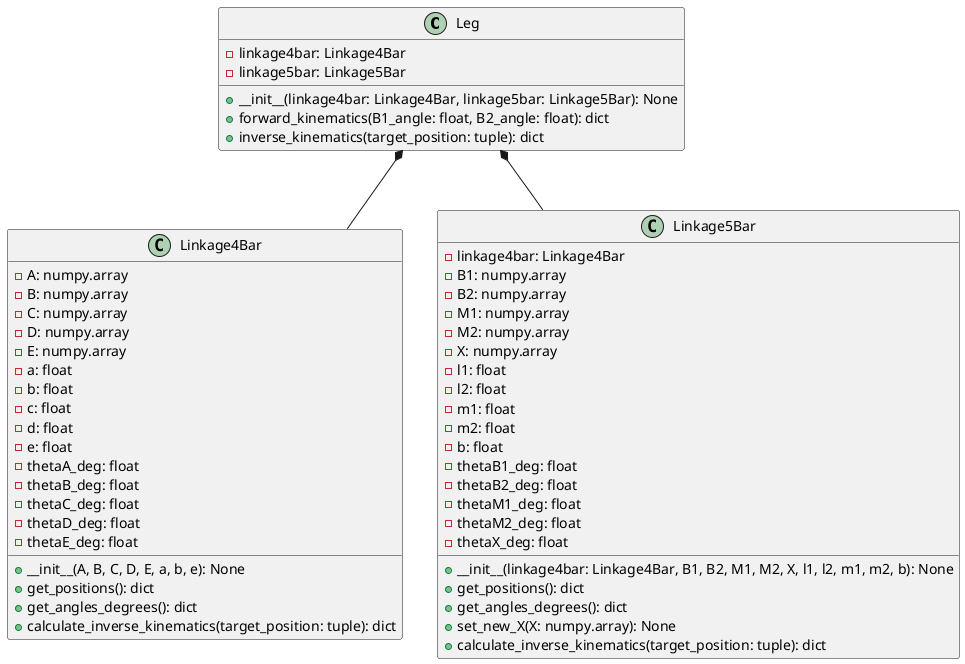
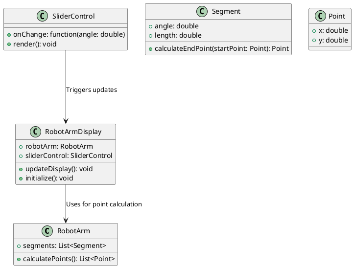

# 5節リンクのプログラム

4節リンクの組み合わせで検討していたが、Dピンの位置にモーター軸の中心を2つ重ねるのは非常に難しい。
ワイヤー駆動も検討したが、工作の精度が出ないとこの構造で安定した動きができない。

そこで、リンク構造を5節リンクと平行リンクを組み合わせたものにしてみる。

頂点Fの回転でBEのリンクを上げ下げし、Hの制御で5節リンクの頂点Jを押し引きすることで、平行リンクの開き具合を調整する。

5節リンク**HIJAF**を作って、座標を計算する。
単純に計算を積み上げて計算可能なので、ここでは5節リンクの座標計算についての説明は省略。

このページを参考にして計算してみた。
https://staff.aist.go.jp/koseki-y/tutorial/parallel/kine5bar1/kine5bar1.htm#x1-84r2

## 逆運動学で平行リンクのE点からモータの角度を計算する。

平行リンクは2リンクモデルと同様（だと思う）ので、点Eの座標からの逆運動を計算する式を使って計算する。
計算式は下のリンクを参考にさせていただきます。
[2リンクモデルの逆運動学を求める！順運動学の式から算出する方法](https://tajimarobotics.com/kinematics-two-link-model-2/)

B1-F-Eの関節とみなして計算します。

事前に長さ$l$と$x,y$を以下のように計算する。$x,y$が原点0からの位置であるように設定する。
$$
\begin{align}
l &= l_1 + a + e \\
(x,y) &= (E_1x,E_1y) - (B_1x,B_1y) \\
\end{align}
$$
逆運動学の計算。
$$
\begin{align}
\delta &= \pm \cos^{-1} \bigl( \frac{x^2+y^2+l^2-b^2}{2l \sqrt{x^2+y^2}} \bigr) + \tan^{-1}(\frac{y}{x}) \\
\phi &= \tan^{-1}(\frac{y-l\sin\delta}{x-l\cos\delta})-\delta
\end{align}
$$

# モーターとリンクの配置

モーターのサイズから決定したパラメータは以下の通り。

**モーターレイアウトのパラメータ**

|モータの四隅|位置(mm)|
|---|---|
|左上|-(diff/2 + 10.5) , 19.5|
|右下|(diff/2 + 10.5) , -20.5|
|diff|10|
|B1-B2の長さ|10 + 20.09|

### 5節リンクと4節リンクのパラメータ

**5節リンク部**

|リンク|長さ(mm)|
|---|---|
|l1|25|
|l2|25|
|m1|50|
|m2|35|

**4節リンク部**

|リンク|長さ(mm)|
|---|---|
|a|25|
|b|80|
|e|80|

**ChatGPTに形状を説明する**
脚の構造を説明します。
この脚の構造は、5節リンクと4節リンクの組み合わせでできている。
リンクの長さは固定。頂点の角度は可変とするが、リンクによる制約を受ける。
脚を側面から見て、右側を前、左側を後と定義する。
脚の原点(0,0)から右側にモーターNo.1の回転軸B1を置き、左側にモーターNo.2の回転軸B2を置く。
B1,B2は5節リンクの頂点で原点に対して固定されている。
B1の先に頂点M1を置き、B2の先に頂点M2を置く。そして、M1とM2の先に頂点Xを置き、この5つの頂点で閉じた5節リンクを構成している。
M1の位置はB1のモーターの角度で決められ、M2の位置はB2のモーターの角度で決まる。
Xの位置はM1,M2の位置で決まる。
5節リンクはB1,B2の角度によって、その位置関係が決定される。

4節リンクは5節リンクと一部の頂点を共有しており、モーターの角度によって位置が決定される。
4節リンクを平行リンクとなるようにリンクの長さを定義する。
4節リンクの頂点は、反時計回りにA,B,C,Dと定義する。
頂点Aは5節リンクの頂点M1でもある。
5節リンクのリンクB1-M1をまっすぐ伸ばした先に、4節リンクの頂点Dを置く。
B1-M1リンクとA-Dリンクは必ず同一直線上に存在する。
5節リンクの頂点Xは、4節リンクのA-Bリンク上に置く。
M1-XリンクとA-Bリンクは必ず同一直線状に存在する。

4節リンクのB-Cリンクをまっすぐ伸ばした先に、頂点Eを置く。
頂点Eを足先と定義し、逆運動を計算するときは、頂点Eを基準にして計算する。

4節リンクと5節リンクの関係を考慮してプログラムを作成することが重要となります。

5節リンクの原点は、B1とB2の中点に置きます。
リンクB1-B2の長さをb
リンクB1-M1の長さをl1
リンクB2-M2の長さをl2
リンクM1-Xの長さをm1
リンクM2-Xの長さをm2
と定義します。

4節リンクは平行リンクとするので、
リンクA-Dの長さをa
リンクA-Bの長さをb
リンクB-Cの長さをa
リンクC-Dの長さをb
と定義します。

$$
A = M1 \\
D = M1 + (\frac{a * (B1 - M1)}{||B1 - M1||}) \\
X = A + (\frac{||M1 - A|| * (B - A)}{||B - A||})\\
$$

---

