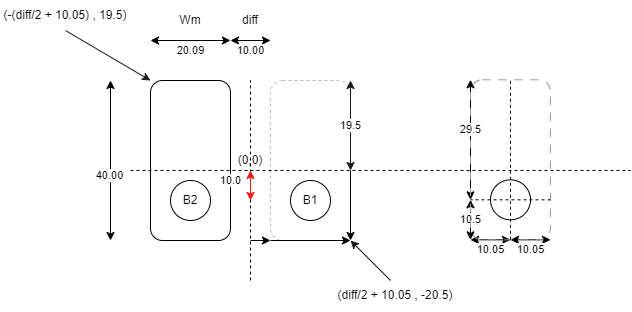
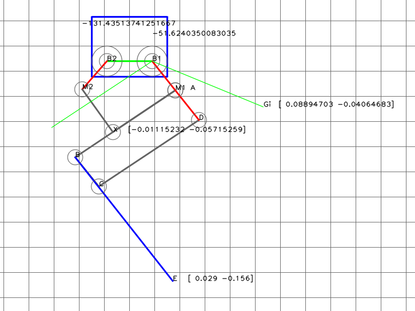

# 5節リンクのプログラム

4節リンクの組み合わせで検討していたが、Dピンの位置にモーター軸の中心を2つ重ねるのは非常に難しい。
ワイヤー駆動も検討したが、工作の精度が出ないとこの構造で安定した動きができない。

そこで、リンク構造を5節リンクと平行リンクを組み合わせたものにしてみる。

頂点Fの回転でBEのリンクを上げ下げし、Hの制御で5節リンクの頂点Jを押し引きすることで、平行リンクの開き具合を調整する。

5節リンク**HIJAF**を作って、座標を計算する。
単純に計算を積み上げて計算可能なので、ここでは5節リンクの座標計算についての説明は省略。

このページを参考にして計算してみた。
https://staff.aist.go.jp/koseki-y/tutorial/parallel/kine5bar1/kine5bar1.htm#x1-84r2

## 逆運動学で平行リンクのE点からモータの角度を計算する。

平行リンクは2リンクモデルと同様（だと思う）ので、点Eの座標からの逆運動を計算する式を使って計算する。
計算式は下のリンクを参考にさせていただきます。
[2リンクモデルの逆運動学を求める！順運動学の式から算出する方法](https://tajimarobotics.com/kinematics-two-link-model-2/)

B1-F-Eの関節とみなして計算します。

事前に長さ$l$と$x,y$を以下のように計算する。$x,y$が原点0からの位置であるように設定する。
$$
\begin{align}
l &= l_1 + a + e \\
(x,y) &= (E_1x,E_1y) - (B_1x,B_1y) \\
\end{align}
$$
逆運動学の計算。
$$
\begin{align}
\delta &= \pm \cos^{-1} \bigl( \frac{x^2+y^2+l^2-b^2}{2l \sqrt{x^2+y^2}} \bigr) + \tan^{-1}(\frac{y}{x}) \\
\phi &= \tan^{-1}(\frac{y-l\sin\delta}{x-l\cos\delta})-\delta
\end{align}
$$

# モーターとリンクの配置

モーターのサイズから決定したパラメータは以下の通り。

**モーターレイアウトのパラメータ**

|モータの四隅|位置(mm)|
|---|---|
|左上|-(diff/2 + 10.5) , 19.5|
|右下|(diff/2 + 10.5) , -20.5|
|diff|10|
|B1-B2の長さ|10 + 20.09|

### 5節リンクと4節リンクのパラメータ

**5節リンク部**

|リンク|長さ(mm)|
|---|---|
|l1|25|
|l2|25|
|m1|50|
|m2|35|

**4節リンク部**

|リンク|長さ(mm)|
|---|---|
|a|25|
|b|80|
|e|80|

