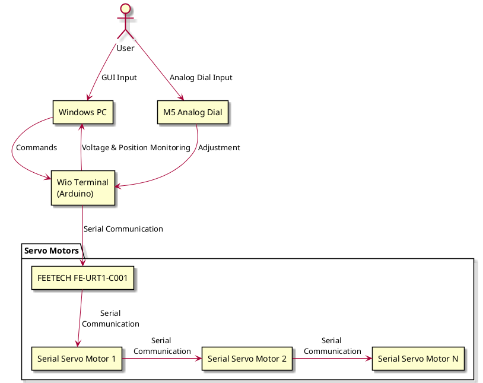

# Wakerシステム設計

## 全体構成の概要
Wakerシステムは複数のシリアルサーボモーターで関節を動かして歩行する。
シリアルサーボはWio terminal(Arduino)に接続して、シリアル通信で動かす。
ユーザーはWio terminalにアナログダイアル(M5 analog)を使って個々のサーボの回転位置を調整したり、
WindowsPCのGUIからの入力でサーボの回転位置を制御する。
また、サーボの電圧や位置を常時監視しWindowsPCのGUIにその波形を表示する。

<!-->
このシステムを実現可能なハードウェアを用意し、プログラムを実装します。
この配置図をPlantumlで書いてください。

ArduinoのC++クラスベースの設計を行います
シリアルサーボモーターのドライバをライブラリ化して汎用的に利用できるようにします。
Windows PC側はPythonで実装します。

https://www.switch-science.com/products/7490

</!-->

Wio Terminal(Arduino)とFEETECH FE-URT1-COO1

Wio Terminal(Arduino)とWindows PCを、USBシリアルで通信するプログラムを設計します。Pythonで実装します。

機能1
PC側はマルチタスク通信でWioからの受信を待ちます。
Wio側は起動してからの経過時間(ms)、サーボの電圧、サーボの位置、傾斜角度などをパックしたデータを固定フォーマットで一括で送信します。
PC側はそれを待ち受けて受け取り、保存します。

機能2
PC側はユーザーからの任意の指令文字列を、Wioに送ります。
Wioは受け取ったらackを返します。