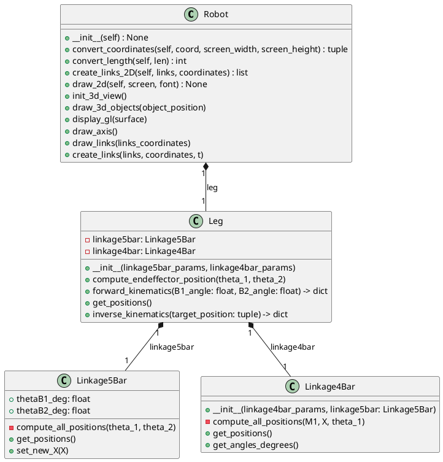
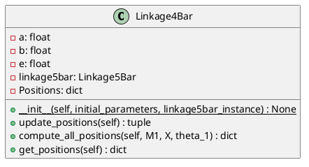
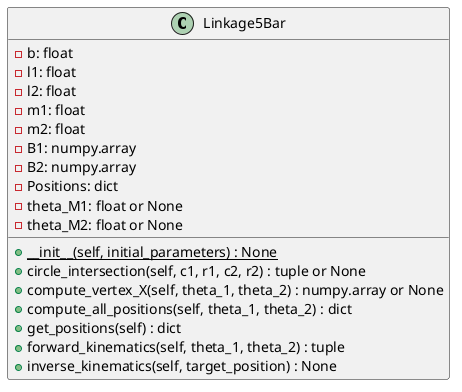
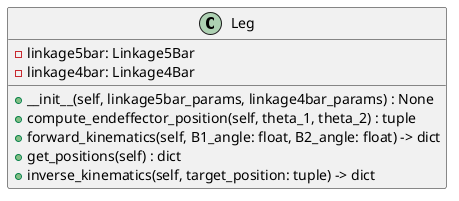
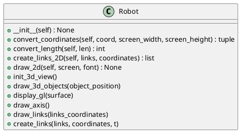

# 二足歩行シミュレータ

5節リンクと4節リンクを組み合わせた構造の脚の動きをシミュレーションします。
この脚を複数組み合わせてロボットを作ります。

以下のようなGUIで指示を与えたり、ロボットを表示します。
+ 2Dで脚の動きを表示する
+ 3Dで脚の動きを表示する
+ スライダコントロールで動きの指示を与える
+ 速度などをグラフ表示する

```
source/
├── main.py
├── leg_simulation/
│   ├── __init__.py
│   ├── leg.py
│   ├── linkage4bar.py
│   ├── linkage5bar.py
│   └── robot.py
│
├── gui_frame/
│   ├── __init__.py
│   ├── GraphGui.py
│   ├── opengl_manager.py
│   ├── pygame_manager.py
│   └── shared_data.py
```

各ファイルの説明:

1. `main.py`: プログラムのメイン部分。他のモジュールをインポートして実行します。
2. `GraphGui.py`: ボタンやスライダ入力と、グラフ表示を行う
3. `opengl_manager.py`: 3D表示を行う
4. `pygame_manager.py`: 2D表示を行う
5. `shared_data.py` : スレッドセーフなデータ共有モジュール

-------

クラス構造

-------

## leg_simulation

### 全体のクラス図:




### 各クラスの仕様:

以下に、Linkage4Bar クラスの詳細な仕様を説明します。この仕様はPythonで実装できるように書かれています。

クラス名: `Linkage4Bar`

```python
import math
import numpy as np
```

## 初期化関数 `__init__(self, initial_parameters, linkage5bar_instance)`

#### 引数:
- `initial_parameters (dict)`: 以下のキーを持つ辞書オブジェクト
  * `a (float)`: リンケージ1の長さ
  * `b (float)`: リンケージ2の長さ
  * `e (float)`: リンケージ3の長さ
- `linkage5bar_instance (Linkage5Bar)`: `Linkage5Bar` クラスのインスタンス

#### 機能:
- インスタンス変数 `Positions` を空の辞書で初期化します。
- 引数 `initial_parameters` からリンケージの長さ `a`, `b`, `e` を設定します。
- 引数 `linkage5bar_instance` をインスタンス変数 `linkage5bar` に格納します。

## 関数 `update_positions(self)`

#### 機能:
- `linkage5bar` インスタンスから位置情報を取得し、それを基に点A、B、C、Dの座標を計算します。
- 点A、B、C、Dの座標をリターンします。

## 関数 `compute_all_positions(self, M1, X, theta_1)`

#### 引数:
- `M1 (tuple)`: M1点の座標 (x, y)
- `X (tuple)`: X点の座標 (x, y)
- `theta_1 (float)`: 角度 θ1

#### 機能:
- 点A、B、C、D、Eの座標を計算し、インスタンス変数 `Positions` に格納します。
- 点A、B、C、D、Eの座標を返します。

## 関数 `get_positions(self)`

#### 機能:
- インスタンス変数 `Positions` を返します。


以下はクラス図です。PlantUMLで描かれています。




以下に、Linkage5Barクラスの詳細な仕様を説明します。この仕様はPythonで実装できるように書かれています。

クラス名: `Linkage5Bar`

```python
import numpy as np
import math
```

## 初期化関数 `__init__(self, initial_parameters)`

#### 引数:
- `initial_parameters (dict)`: 以下のキーを持つ辞書オブジェクト
  * `b (float)`: リンケージ b の長さ
  * `l1 (float)`: リンケージ l1 の長さ
  * `l2 (float)`: リンケージ l2 の長さ
  * `m1 (float)`: リンケージ m1 の長さ
  * `m2 (float)`: リンケージ m2 の長さ

#### 機能:
- インスタンス変数 `Positions` を空の辞書で初期化します。
- 引数 `initial_parameters` からリンケージの長さ `b`, `l1`, `l2`, `m1`, `m2` を設定します。
- 点B1とB2の座標を計算し、インスタンス変数に格納します。
- インスタンス変数 `theta_M1` および `theta_M2` を `None` で初期化します。

## 関数 `circle_intersection(self, c1, r1, c2, r2)`

#### 引数:
- `c1 (numpy.array)`: 円1の中心座標
- `r1 (float)`: 円1の半径
- `c2 (numpy.array)`: 円2の中心座標
- `r2 (float)`: 円2の半径

#### 機能:
- 円1と円2の交点を計算します。
- 交点が存在しない場合は `None` を返します。存在する場合、交点の座標を含むタプルを返します。

## 関数 `compute_vertex_X(self, theta_1, theta_2)`

#### 引数:
- `theta_1 (float)`: 角度θ1
- `theta_2 (float)`: 角度θ2

#### 機能:
- フォワードキネマティクス関数 `forward_kinematics()` を使って、x_M1およびx_M2の座標を計算します。
- 交点が存在しない場合は `None` を返す。存在する場合、y座標が小さい頂点Xを選択し、その座標を返します。

## 関数 `compute_all_positions(self, theta_1, theta_2)`

#### 引数:
- `theta_1 (float)`: 角度θ1
- `theta_2 (float)`: 角度θ2

#### 機能:
- 点M1、M2およびXの座標を計算し、インスタンス変数 `Positions` に格納します。
- インスタンス変数 `Positions` を返します。

## 関数 `get_positions(self)`

#### 機能:
- インスタンス変数 `Positions` を返します。

## 関数 `forward_kinematics(self, theta_1, theta_2)`

#### 引数:
- `theta_1 (float)`: 角度θ1
- `theta_2 (float)`: 角度θ2

#### 機能:
- x_M1およびx_M2の座標を計算し、それらを含むタプルを返します。

## 関数 `inverse_kinematics(self, target_position)`

#### 引数:
- `target_position (tuple)`: 目標位置座標 (x, y)

#### 機能:
- 逆キネマティクスを使って、目標位置に到達するための角度θ1とθ2を計算し、インスタンス変数に格納します。

以下はクラス図です。PlantUMLで描かれています。



この仕様書を参考にプログラムを実装することができます。

以下に、Legクラスの詳細な仕様を説明します。この仕様はPythonで実装できるように書かれています。

クラス名: `Leg`

```python
import math
from linkage5bar import Linkage5Bar
from linkage4bar import Linkage4Bar
```

## 初期化関数 `__init__(self, linkage5bar_params, linkage4bar_params)`

#### 引数:
- `linkage5bar_params (dict)`: Linkage5Bar クラスの初期化パラメーター
- `linkage4bar_params (dict)`: Linkage4Bar クラスの初期化パラメーター

#### 機能:
- Linkage5BarオブジェクトおよびLinkage4Barオブジェクトを生成し、インスタンス変数に格納します。

## 関数 `compute_endeffector_position(self, theta_1, theta_2)`

#### 引数:
- `theta_1 (float)`: 角度θ1
- `theta_2 (float)`: 角度θ2

#### 機能:
- 与えられた角度θ1とθ2を使用して、エンドエフェクタ（末端操作器）の位置を計算します。
- 末端操作器の座標を返します。

## 関数 `forward_kinematics(self, B1_angle: float, B2_angle: float) -> dict`

#### 引数:
- `B1_angle (float)`: B1の角度
- `B2_angle (float)`: B2の角度

#### 機能:
- フォワードキネマティクスを使って、リンケージ両方の新しい座標と角度を計算します。
- 結果として得られるリンケージの座標と角度を辞書で返します。

## 関数 `get_positions(self)`

#### 機能:
- 両方のリンケージオブジェクト（Linkage5BarおよびLinkage4Bar）から得られた座標を結合した辞書を返します。

## 関数 `inverse_kinematics(self, target_position: tuple) -> dict`

#### 引数:
- `target_position (tuple)`: 目標位置座標 (x, y)

#### 機能:
- 逆キネマティクスを使って、目標位置に到達するために必要な関節角度を計算します。（未実装）

以下はクラス図です。PlantUMLで描かれています。



この仕様書を参考にプログラムを実装することができます。

以下に、Robotクラスの詳細な仕様を説明します。この仕様はPythonで実装できるように書かれています。

クラス名: `Robot`

```python
import math
import numpy as np
from OpenGL.GL import *
from OpenGL.GLUT import *
from OpenGL.GLU import *

import pygame
import sys
from leg import Leg
```

以下、Robotクラスの機能仕様になります：

### 初期化関数 `__init__(self)`
- 引数：
  - なし
- 機能：
  - スクリーンサイズやスケールファクタを設定
  - 5バーリンケージと4バーリンケージのパラメータを設定
  - リンクリスト（接続されているポイントのペア）を設定
  - Legオブジェクトを作成し、現在位置を計算

### 座標変換関数 `convert_coordinates(self, coord, screen_width, screen_height)`
- 引数：
  - coord (tuple): 変換する座標 (x, y)
  - screen_width (int): 画面の幅
  - screen_height (int): 画面の高さ
- 機能：
  - 入力された座標をスクリーンの表示用座標に変換する

### 長さ変換関数 `convert_length(self, len)`
- 引数：
  - len (float): 変換する長さ
- 機能：
  - スケールファクタを使用して入力された長さを整数に変換する

### リンク生成関数 `create_links_2D(self, links, coordinates)`
- 引数：
  - links (set): 二次元リンクのセット
  - coordinates (dictionary): 各頂点の座標を含むディクショナリ
- 機能：
  - リンクリストに基づいて2Dリンク座標のリストを生成する

### 2D描画関数 `draw_2d(self, screen, font)`
- 引数：
  - screen: Pygameのスクリーンオブジェクト
  - font: Pygameのフォントオブジェクト
- 機能：
  - 2Dビューでロボットの脚を表示
  - 頂点、リンク、座標軸、目盛りとラベルを描画

### 3Dビュー初期化関数 `init_3d_view(self)`
- 引数：
  - なし
- 機能：
  - ビューポート（視野角、アスペクト比、近/遠クリップ平面）を設定
  - 初期位置（平行移動）を設定
  - OpenGL Utility Toolkit (GLUT) を初期化

### 3Dオブジェクト描画関数 `draw_3d_objects(self, object_position)`
- 引数：
  - object_position (tuple): オブジェクトの位置 (x, y, z)
- 機能：
  - 頂点とリンクを3Dで描画

### 3D表示関数 `display_gl(self, surface)`
- 引数：
  - surface: Pygameのスクリーンオブジェクト
- 機能：
  - 背景（バッファ）をクリア
  - 座標系の変換および回転
  - 脚の座標を取得してリンク座標リストを作成
  - 座標軸とリンクを描画

### 座標軸描画関数 `draw_axis(self)`
- 引数：
  - なし
- 機能：
  - X, Y, Z座標軸を描画

### リンク描画関数 `draw_links(self, links_coordinates)`
- 引数：
  - links_coordinates (list): 描画するリンク座標のリスト
- 機能：
  - 3Dで各リンクを描画

### 3Dリンク作成関数 `create_links(self, links, coordinates, t)`
- 引数：
  - links (set): 3次元リンクのセット
  - coordinates (dictionary): 各頂点の座標を含むディクショナリ
  - t (float): Z座標の値
- 機能：
  - リンクリストに基づいて3Dリンク座標のリストを生成する

以下、更新されたクラス図：


