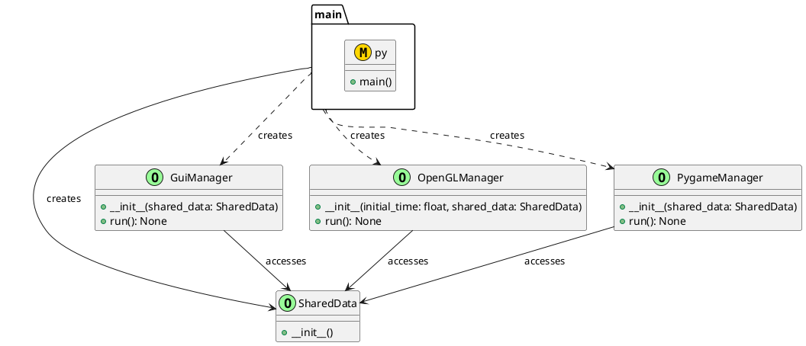
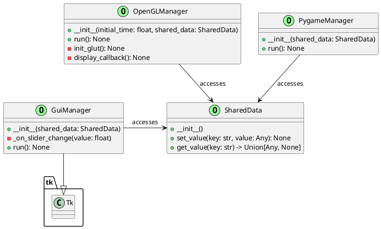
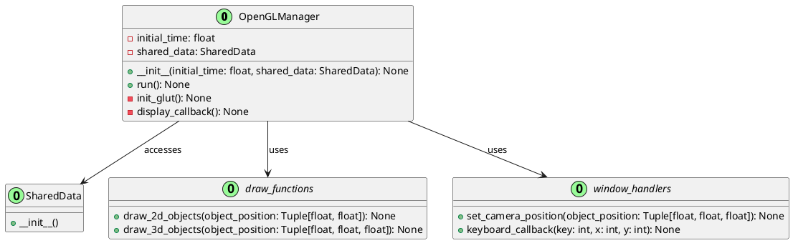
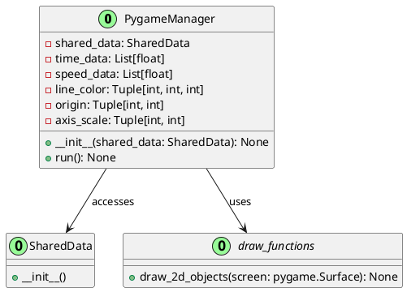
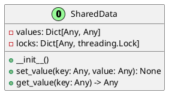
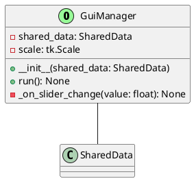
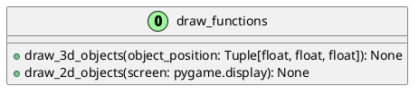
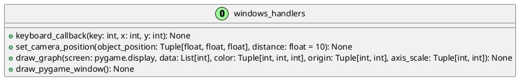

# 歩行ロボットのシミュレーションGUIフレーム

```
project/
|-- main.py
|-- config.py
|-- draw_functions.py
|-- utils.py
|-- window_handlers.py
|-- readme.md
```

各ファイルの説明:

1. `main.py`: プログラムのメイン部分。他のモジュールをインポートして実行します。
2. `config.py`: 全体的な設定を保存する。ウィンドウサイズやカメラ設定など。
3. `draw_functions.py`: オブジェクトの描画に関連する関数を記述する。
4. `utils.py`: 汎用的な関数を保存する。例えば、速度に基づいて色を取得する関数など。
5. `window_handlers.py`: PygameおよびOpenGLのウィンドウ処理とイベント処理を行う。
6. `readme.md`: この文書


data = {
        "model": model_engine,
        "messages"🙁
            {"role": "system", "content": system},
            {"role": "user", "content": prompt}
        ],
    }

-------

main.py - エントリーポイントとしてプログラムを実行
GuiManager - GUI操作を管理
OpenGLManager - 3D画面の描画を担当
PygameManager - 2D画面の描画を担当
SharedData - 変数を共有するためのデータクラス

**初期化**


---

**実行時**


各クラスの仕様書をChatGPTに書いてもらうため、今まで作ったテスト用のソフトを渡して指示を出します。
以下、指示を出すときのテンプレです。

>OpenGLManagerクラスの機能を表した詳細な仕様を説明してください。
仕様を読んだプログラマがpythonで実装できるように書いてください。
マークダウンでお願いします。
また、OpenGLManagerのクラス図をplantumlで詳細に書いて実装に役立てることができるようにしてください。
以下、ソースコードです。

以下の出力を得ました。

---

以下は、`OpenGLManager` クラスの機能を表した詳細な仕様です。

## OpenGLManagerクラス仕様

### 概要
`OpenGLManager` クラスは、3Dオブジェクトの表示と操作を行うためのクラスです。OpenGLを使用して3Dオブジェクトを描画し、キーボードコールバックを利用してカメラの位置を制御します。

### 初期化関数 `__init__(self, initial_time, shared_data)`
- 引数：
  - `initial_time`: アプリケーションの開始時刻
  - `shared_data`: 他のマネージャと共有するデータを持つ `SharedData` インスタンス
- 機能：`initial_time` と `shared_data` をインスタンス変数に保存します。

### run(self)
- 機能: GLUTを初期化し、ウィンドウを作成します。プロジェクション行列を設定し、GLUTのメインループに入ります。

### init_glut(self)
- 機能: GLUTを初期化し、描画モード、ウィンドウサイズ、ウィンドウタイトルを設定します。深度テストを有効にし、背景色を設定します。さらに、GLUTのコールバック関数を設定します。

### display_callback(self)
- 機能: ディスプレイコールバック関数です。画面をクリアし、`shared_data` から現在の速度を取得します。オブジェクトの位置を更新し、3Dオブジェクトを描画します。カメラの位置を更新し、バッファを入れ替えます。

以下は、`OpenGLManager` クラスの詳細なPlantUMLクラス図です:



このクラス図では、`OpenGLManager` クラスが `SharedData` クラスとインターフェース (`draw_functions` および `window_handlers`) を使用していることが示されています。また、主要なメソッドと属性がリストされています。これにより、プログラマはクラスを実装する際に必要な情報が得られます。

---

>PygameManagerクラスの機能を表した詳細な仕様を説明してください。
仕様を読んだプログラマがpythonで実装できるように書いてください。
マークダウンでお願いします。
また、PygameManagerのクラス図をplantumlで詳細に書いて実装に役立てることができるようにしてください。
以下、ソースコードです。

以下の出力を得ました。

---

以下は、`PygameManager` クラスの機能を表した詳細な仕様です。

## PygameManagerクラス仕様

### 概要
`PygameManager` クラスは、2Dオブジェクトの表示と制御を行うためのクラスです。Pygameを使用してウィンドウを作成し、2Dオブジェクトを描画します。物体の位置や速度を共有データとして利用します。

### 初期化関数 `__init__(self, shared_data)`
- 引数：
  - `shared_data`: 他のマネージャと共有するデータを持つ `SharedData` インスタンス
- 機能：`shared_data` をインスタンス変数に保存し、時間データ、速度データ、線の色、原点座標、軸スケールを初期化します。

### run(self)
- 機能: Pygameを初期化し、ウィンドウを作成します。ウィンドウタイトルを設定し、イベントループを開始します。画面を更新し、2Dオブジェクトを描画します。終了イベントが発生したらループを抜け、Pygameを終了します。

以下は、`PygameManager` クラスの詳細なPlantUMLクラス図です:



このクラス図では、`PygameManager` クラスが `SharedData` クラスとインターフェース `draw_functions` を使用していることが示されています。また、主要なメソッドと属性がリストされています。これにより、プログラマはクラスを実装する際に必要な情報が得られます。

---

>SharedDataクラスの機能を表した詳細な仕様を説明してください。
仕様を読んだプログラマがpythonで実装できるように書いてください。
マークダウンでお願いします。
また、SharedDataのクラス図をplantumlで詳細に書いて実装に役立てることができるようにしてください。
以下、ソースコードです。

---

以下は、`SharedData` クラスの機能を表した詳細な仕様です。

## SharedDataクラス仕様

### 概要
`SharedData` クラスは、複数のスレッド間で共有されるデータを管理するためのクラスです。キーと値のペアでデータを格納し、スレッドセーフなアクセスを提供します。

### 初期化関数 `__init__(self)`
- 機能：空の辞書 `values` と `locks` を作成します。 `values` は共有データを保存するために使用され、 `locks` は各キーに対応するロックを格納するために使用されます。

### set_value(self, key, value)
- 引数：
  - `key`: 共有データのキー
  - `value`: 対応する共有データの値
- 機能：ロックを用いてデータを保存します。必要に応じて新しいロックを作成し、キーと値を `values` に設定します。

### get_value(self, key)
- 引数：
  - `key`: 取得する共有データのキー
- 戻り値：対応する共有データの値（存在しない場合はNone）
- 機能：キーに対応するロックが存在し、ロックされていない場合は、データの値を取得します。そうでなければ、キーに対応する値が格納されているかどうかを確認し、存在すればその値を返します。

以下は、`SharedData` クラスの詳細なPlantUMLクラス図です:



このクラス図では、`SharedData` クラスが `threading.Lock` を使用しており、主要なメソッドと属性がリストされています。これにより、プログラマはクラスを実装する際に必要な情報が得られます。

---

>GuiManagerクラスの機能を表した詳細な仕様を説明してください。
仕様を読んだプログラマがpythonで実装できるように書いてください。
マークダウンでお願いします。
また、GuiManagerのクラス図をplantumlで詳細に書いて実装に役立てることができるようにしてください。
以下、ソースコードです。

---

以下は、`GuiManager` クラスの機能を表した詳細な仕様です。

## GuiManagerクラス仕様

### 概要
`GuiManager`クラスは、共有データとグラフィカルユーザーインターフェース(GUI)管理用のクラスです。tkinter ライブラリを使用し、スライダーを作成してキー "speed" の値を変更できます。

### 初期化関数 `__init__(self, shared_data)`
- 引数：
  - `shared_data`: SharedData オブジェクト
- 機能：ウィンドウタイトルと共有データポインタを設定します。また、水平スライダーも作成し、初期値を 0 に設定します。スライダーが変更されるたびに、`_on_slider_change` 関数が呼び出されます。

### _on_slider_change(self, value)
- 引数：
  - `value`: スライダーから取得した新しい値
- 機能：共有データオブジェクト内のキー "speed" の値をスライダーの値に更新します。

### run(self)
- 機能：Tkinter の mainloop を呼び出し、GUIを実行します。

以下は、`GuiManager` クラスの詳細なPlantUMLクラス図です:



このクラス図では、`GuiManager` クラスが `SharedData` クラスと関連があり、主要なメソッドや属性がリストされています。これにより、プログラマはクラスを実装する際に必要な情報が得られます。

---

>draw_functions.pyの機能を表した詳細な仕様を説明してください。
仕様を読んだプログラマがpythonで実装できるように書いてください。
マークダウンでお願いします。
また、draw_functions.pyのクラス図をplantumlで詳細に書いて実装に役立てることができるようにしてください。
以下、ソースコードです。

---

以下は、`draw_functions.py` の機能を表した詳細な仕様です。

## draw_functions.py 仕様

### 概要
`draw_functions.py`モジュールでは、3D オブジェクトと 2D オブジェクトの描画関数が提供されています。これらの関数は、OpenGL および Pygame ライブラリを使用してグラフィックスを描画します。

### draw_3d_objects(object_position)
- 引数：
  - `object_position`: オブジェクトの位置タプル（x, y, z）
- 機能：与えられたオブジェクトの位置において、速度に基づいた色で球体を描画します。また、頂点と線を描画します。
  
### draw_2d_objects(screen)
- 引数：
  - `screen`: Pygame スクリーンオブジェクト
- 機能：Pygame を使用して、スクリーン上に静的な円と線を描画します。

以下は、`draw_functions.py` モジュールの詳細な PlantUML クラス図です:



このクラス図では、描画関数がどのような引数を受け取り、どのような機能を持っているかをリストしています。これにより、プログラマはモジュールを実装する際に必要な情報が得られます。

---

>windows_handlers.pyの機能を表した詳細な仕様を説明してください。
仕様を読んだプログラマがpythonで実装できるように書いてください。
マークダウンでお願いします。
また、windows_handlers.pyのクラス図をplantumlで詳細に書いて実装に役立てることができるようにしてください。
以下、ソースコードです。

---

以下は、`windows_handlers.py` の機能を表した詳細な仕様です。

## windows_handlers.py 仕様

### 概要
`windows_handlers.py` モジュールでは、キーボード入力の処理とウィンドウ表示に関連する関数が提供されています。また、OpenGLおよびPygameライブラリを使用してグラフィックスを描画します。

### keyboard_callback(key, x, y)
- 引数：
  - `key`: 押されたキーコード
  - `x`, `y`: キーイベント時のマウスポインタの座標
- 機能：特定のキー入力に応じて速度を増減させ、現在の速度をコンソールに出力します。

### set_camera_position(object_position, distance=10)
- 引数：
  - `object_position`: オブジェクトの位置タプル（x, y, z）
  - `distance`: カメラからオブジェクトまでの距離（デフォルトは10）
- 機能：カメラの位置と注視点を設定し、3Dシーンの表示を更新します。

### draw_graph(screen, data, color, origin, axis_scale)
- 引数：
  - `screen`: Pygame スクリーンオブジェクト
  - `data`: グラフに表示するデータのリスト
  - `color`: グラフの線の色
  - `origin`: グラフの原点座標（x, y）
  - `axis_scale`: x軸およびy軸の単位スケール
- 機能：Pygameを使用して、指定されたデータをグラフとして描画します。

### draw_pygame_window()
- 引数：なし
- 機能：Pygameウィンドウを作成し、2Dオブジェクトとグラフを描画します。ウィンドウが閉じられるか、Escキーが押されるまで実行を継続します。

以下は、`windows_handlers.py` モジュールの詳細な PlantUML クラス図です:



このクラス図では、各関数がどのような引数を受け取り、どのような機能を持っているかをリストしています。これにより、プログラマはモジュールを実装する際に必要な情報が得られます。
